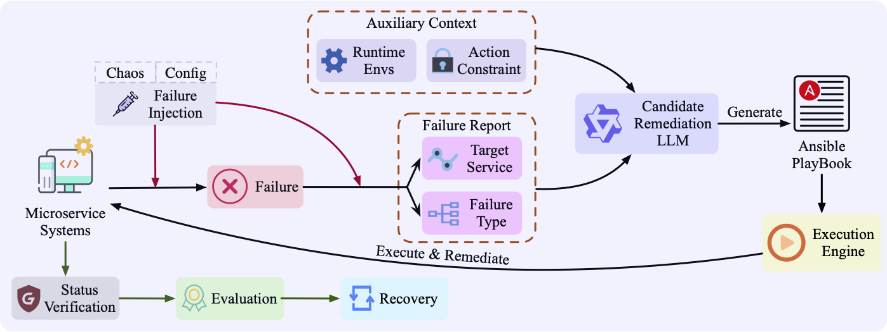
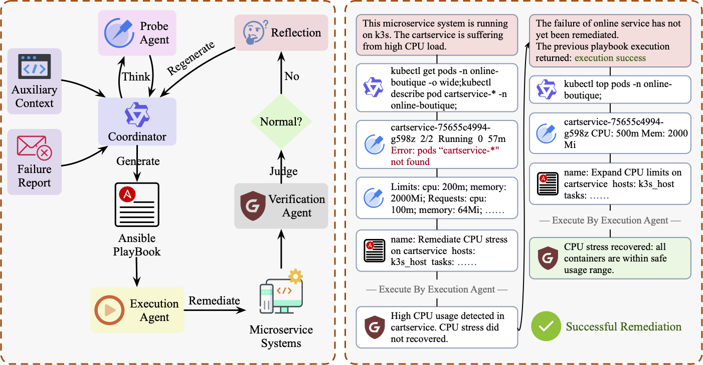

<div align="center">


# MicroRemed: Benchmarking LLMs in Microservices Remediation

[](https://arxiv.org/abs/2508.07173)

</div>

> [!NOTE]
> 
> The MicroRemed benchmark and the LLM backbone are designed to run within the same repository. In other words, if you intend to use this setup, you must ensure that both the microservice environment and the LLM can be executed on the same machine. This can be challenging on many non-bare-metal servers (e.g., DSW, DLC), where deploying large models often lacks the necessary permissions to create containers (e.g., Docker or containerd) for launching microservices.  
>
> To address this, we provide an alternative setup via [MicroRemed-CS](https://github.com/LLM4AIOps/MicroRemed-CS), which supports a client-server mode. In this configuration, microservices are deployed on one cluster, exposing operational interfaces, while the LLM runs on a separate cluster and interacts with the microservices remotely. Despite this separation, the overall benchmarking methodology remains consistent with the original MicroRemed design.

## 👋 Overview

MicroRemed is a benchmark for assessing large language models in end-to-end microservice remediation, aiming to directly produce executable Ansible playbooks from diagnosis reports and autonomously restore faulty systems.
<div align="center">



</div>

> **MicroRemed’s design adheres to the following principles:**
>
> ---
> ### 🧩 **Dynamic Execution Benchmark**
> Unlike most LLM benchmarks that collect static data to form fixed datasets, **MicroRemed** is designed as a *live and interactive execution environment*.  
> It actively launches real microservice systems, injects controlled failures, and interacts dynamically with running services.  
> This design enables the benchmark to capture **real-time behaviors**, **system dynamics**, and **contextual dependencies** that static datasets cannot represent.  
>
> ---
> ### ⚙️ **Execution-based Evaluation**
> Evaluation is **not** determined by linguistic or structural similarity of generated outputs,  
> but by **execution outcomes**.  
> Each generated playbook is executed within the microservice environment,  
> and the benchmark verifies success by assessing whether the system has been **fully recovered to its normal operational state**.  
>
> ---
> ### 🌐 **Comprehensive Scalability**
> Built on these foundations, the benchmark is designed to be:
> - **Method-scalable** – supports diverse LLM-based remediation methods.  
> - **LLM-scalable** – allows plug-and-play replacement of remediation models.  
> - **Failure-scalable** – accommodates various failure scenarios.  
> - **System-scalable** – easily extendable to new microservice systems with minimal configuration effort.  

## 💜 Statistics

**MicroRemed** currently includes, **seven representative failure types**, **three real-world microservice systems**, and **two reference methodologies**.

---

### 🧩 Failure Types

<table style="width:100%; border-collapse: collapse; text-align:center;">
  <thead>
    <tr style="background-color:#f2f2f2;">
      <th style="padding:6px; border:1px solid #ccc;">No.</th>
      <th style="padding:6px; border:1px solid #ccc;">Category</th>
      <th style="padding:6px; border:1px solid #ccc;">Failure Types</th>
    </tr>
  </thead>
  <tbody>
    <tr>
      <td style="border:1px solid #ccc;">1</td>
      <td style="border:1px solid #ccc;" rowspan="3"><b>Resource-Level</b></td>
      <td style="border:1px solid #ccc;">CPU Saturation</td>
    </tr>
    <tr>
      <td style="border:1px solid #ccc;">2</td>
      <td style="border:1px solid #ccc;">Memory Saturation</td>
    </tr>
    <tr>
      <td style="border:1px solid #ccc;">3</td>
      <td style="border:1px solid #ccc;">IO Saturation</td>
    </tr>
    <tr>
      <td style="border:1px solid #ccc;">4</td>
      <td style="border:1px solid #ccc;" rowspan="2"><b>Network-Level</b></td>
      <td style="border:1px solid #ccc;">Network Loss</td>
    </tr>
    <tr>
      <td style="border:1px solid #ccc;">5</td>
      <td style="border:1px solid #ccc;">Network Delay</td>
    </tr>
    <tr>
      <td style="border:1px solid #ccc;">6</td>
      <td style="border:1px solid #ccc;" rowspan="2"><b>Application-Level</b></td>
      <td style="border:1px solid #ccc;">Pod Failure</td>
    </tr>
    <tr>
      <td style="border:1px solid #ccc;">7</td>
      <td style="border:1px solid #ccc;">Configuration Error</td>
    </tr>
  </tbody>
</table>

---

### 🏗️ Microservice Systems

**MicroRemed** integrates **three microservice systems**:

- **Train-Ticket** [[Zhou et al., 2018]](https://github.com/FudanSELab/train-ticket): a comprehensive benchmark simulating a railway ticketing platform.  
- **Online-Boutique** [[Google, 2025]](https://github.com/GoogleCloudPlatform/microservices-demo): an e-commerce microservice application widely used in reliability and observability studies.  
- **Simple-Micro**: a self-developed lightweight system designed for controlled experimentation and fine-grained analysis.

---

### ⚖️ Difficulty Levels

Although MicroRemed supports arbitrary combinations of injected failures,  
we define **three standardized difficulty levels** to ensure fair and structured comparison across remediation methods:

|      Level       | #Cases | Included Failure Types                                                                                          |
|:----------------:| :----: | :-------------------------------------------------------------------------------------------------------------- |
|   🟢 **Easy**    |   23   | CPU Saturation, Memory Saturation, Network Loss, Network Delay                                                  |
|  🟡 **Medium**   |   49   | CPU Saturation, Memory Saturation, IO Saturation, Network Loss, Network Delay, Pod Failure                      |
|   🔴 **Hard**    |   80   | CPU Saturation, Memory Saturation, IO Saturation, Network Loss, Network Delay, Pod Failure, Configuration Error |


---

### 🧩 Reference Methodologies

To facilitate fair evaluation and comparison across different LLMs, we introduce two reference methodologies: **SoloGen** and **ThinkRemed**.

### ⚡ SoloGen

SoloGen represents a straightforward one-shot generation baseline. It replaces the candidate remediation LLM in the MicroRemed pipeline with a pre-trained large language model that receives all relevant contextual information in a single prompt and directly outputs the final Ansible playbook. This approach eliminates intermediate reasoning or iterative refinement, serving as a minimal yet effective baseline for debugging and evaluating the benchmark setup.

### 🤖 ThinkRemed

While SoloGen performs direct generation without adaptive reasoning, it often struggles with complex multi-service dependencies and incomplete contextual information. To address these limitations, we propose **ThinkRemed**, a multi-agent framework designed to emulate the SRE-like remediation process in microservice systems.



As illustrated in the figure above, ThinkRemed comprises four cooperative agents—**Coordinator**, **Probe**, **Execution**, and **Verification**—that operate within an iterative reasoning–action–reflection loop. 

1. The **Coordinator** first receives the auxiliary context `C0` and failure report `R0`, and adaptively determines whether to invoke the **Probe Agent** to collect additional runtime information from the system.
2. It then synthesizes a candidate Ansible playbook `p_t`, which is executed by the **Execution Agent** to remediate the faulty microservice system.
3. The **Verification Agent** subsequently assesses the remediation result, producing a binary outcome `v_t ∈ {0,1}` indicating success or failure.
4. If remediation fails, the system enters a reflection phase, and control returns to the **Coordinator** for iterative refinement based on feedback.

To ensure timely remediation and accommodate LLM context limitations, the iteration loop is bounded by a maximum trial budget `T_max`.

---

## 📦 Repository Structure

The **MicroRemed benchmark repository** is organized as follows:  

- 📁 **`chaos/`** — Contains all configurations and scripts for **failure injection** and **recovery**, including both **Chaos Mesh–based faults** and **configuration-driven dynamic modifications**.  
- 🧩 **`envs/`** — Hosts the built-in **microservice systems** (*Train-Ticket*, *Online-Boutique*, and *Simple-Micro*). Additional systems can be easily added to this directory.  
- 📊 **`experiments/`** — Provides a collection of **predefined failure sequences** used for fair and reproducible evaluations.  
- 🧠 **`methods/`** — Includes implementations of different **microservice remediation methods**. Currently, it contains two representative approaches: **SoloGen** and **ThinkRemed**.  
- 🤖 **`models/`** — Defines the **base LLM invocation logic** for various remediation agents.  
- ⚙️ **`scripts/`** — Contains essential scripts for **installation**, **startup**, and **shutdown** of benchmark components.  

---

### 🗂️ Directory Tree

```text
├── README.md
├── chaos
│   ├── __init__.py
│   ├── check_status.py
│   ├── deployment.py
│   ├── failures.py
│   ├── injection.py
│   └── templates
│       ├── cpu-stress.yaml
│       ├── disk-io.yaml
│       ├── memory-stress.yaml
│       ├── network-delay.yaml
│       ├── network-loss.yaml
│       └── pod-fail.yaml
├── config.py
├── envs
│   ├── __init__.py
│   ├── env.py
│   ├── online-boutique
│   │   ├── deploy.sh
│   │   └── kubernetes-manifests.yaml
│   ├── simple-micro
│   │   ├── deploy.sh
│   │   └── k8s-deploy.yaml
│   ├── source-config
│   │   ├── online-boutique-config.yaml
│   │   ├── simple-micro-config.yaml
│   │   └── train-ticket-config.yaml
│   └── train-ticket
│       ├── CHANGELOG-1.0.md
│       ├── LICENSE
│       ├── Makefile
│       ├── README.md
│       ├── build_upload_image.py
│       ├── deploy.sh
│       ├── deployment
│       ├── docker-compose.yml
│       ├── hack
│       └── pom.xml
├── experiments
│   ├── cpu-stress.txt
│   ├── disk-io.txt
│   ├── easy.txt
│   ├── hard.txt
│   ├── medium.txt
│   ├── memory-stress.txt
│   ├── network-delay.txt
│   ├── network-loss.txt
│   ├── pod-config-error.txt
│   └── pod-fail.txt
├── inject_and_remediate.py
├── inventory.ini
├── logs
├── methods
│   ├── ThinkRemed
│   │   ├── __init__.py
│   │   ├── coordinator.py
│   │   ├── probe_agent.py
│   │   ├── tools.py
│   │   └── verification_agent.py
│   ├── SoloGen
│   │   ├── __init__.py
│   │   ├── generator.py
│   │   └── tools.py
│   ├── __init__.py
│   ├── execution_agent.py
│   └── remediate.py
├── models
│   ├── __init__.py
│   └── llm.py
├── requirement.txt
├── scripts
│   ├── install.sh
│   ├── install_ansible.sh
│   ├── install_chaos.sh
│   ├── install_k3s.sh
│   ├── run.sh
│   ├── run_all.sh
│   ├── start_chaos.sh
│   ├── stop.sh
│   └── stop_chaos.sh
```
---

## 💽 How to Use

This section describes how to set up and run MicroRemed for evaluating LLM-based microservice remediation methods.

### 1. Setup

To prepare the environment, execute the installation script and install Python dependencies:

```shell
cd MicroRemed
./scripts/install.sh
pip install -r requirement.txt
```

This will automatically install and configure:
- k3s (lightweight Kubernetes)
- Chaos Mesh (for controlled failure injection)
- Ansible (for automated remediation)
- Python packages required for running the benchmark

### 2. Usage

MicroRemed provides two usage modes: quick-start and custom.

#### 2.1 Quick-start

If no additional configuration is required, you can directly run:

```shell
./scripts/run_all.sh <env_name> <log_dir> <model>
```

Example:

```shell
./scripts/run_all.sh train-ticket logs/qwen-plus qwen-plus
```

- `<env_name>`: Target microservice environment (e.g., `train-ticket`)  
- `<log_dir>`: Directory to store experiment logs  
- `<model>`: Backbone LLM to use for remediation (e.g., `qwen-plus`)  

This will automatically:  
1. Launch the specified environment  
2. Inject failures as defined in the benchmark  
3. Use the specified LLM to generate remediation playbook  
4. Save logs under the specified directory

#### 2.2 Custom Mode

For fine-grained control over experiments, use inject_and_remediate.py:

```shell
python3 inject_and_remediate.py \
  --experiments 50 \
  --namespace train-ticket \
  --wait-interval 10 \
  --injection-timeout 60 \
  --env train-ticket \
  --save-path conversations \
  --manifest-path envs/source-config/train-ticket-config.yaml \
  --remediate-method SoloGen \
  --experiment-path experiments/easy.txt \
  --model qwen-plus
```

🔧 Key Arguments:

<table>
  <thead>
    <tr>
      <th style="text-align:left;">Argument</th>
      <th style="text-align:center;">Type</th>
      <th style="text-align:center;">Default</th>
      <th style="text-align:left;">Description</th>
    </tr>
  </thead>
  <tbody>
    <tr>
      <td><code>--experiments</code></td>
      <td align="center">int</td>
      <td align="center">100</td>
      <td>Number of experiments to run.</td>
    </tr>
    <tr>
      <td><code>--namespace</code></td>
      <td align="center">str</td>
      <td align="center">default</td>
      <td>Kubernetes namespace to target.</td>
    </tr>
    <tr>
      <td><code>--wait-interval</code></td>
      <td align="center">int</td>
      <td align="center">10</td>
      <td>Interval (seconds) between system status checks.</td>
    </tr>
    <tr>
      <td><code>--injection-timeout</code></td>
      <td align="center">int</td>
      <td align="center">30</td>
      <td>Timeout (seconds) for failure injection.</td>
    </tr>
    <tr>
      <td><code>--env</code></td>
      <td align="center">str</td>
      <td align="center">train-ticket</td>
      <td>Target environment identifier.</td>
    </tr>
    <tr>
      <td><code>--save-path</code></td>
      <td align="center">str</td>
      <td align="center">conversations</td>
      <td>Directory to store conversation logs.</td>
    </tr>
    <tr>
      <td><code>--manifest-path</code></td>
      <td align="center">str</td>
      <td align="center">N/A</td>
      <td>Path to the original service configuration for restoration.</td>
    </tr>
    <tr>
      <td><code>--remediate-method</code></td>
      <td align="center">str</td>
      <td align="center">ThinkRemed</td>
      <td>Remediation method to use (<code>ThinkRemed</code> / <code>SoloGen</code>).</td>
    </tr>
    <tr>
      <td><code>--experiment-path</code></td>
      <td align="center">str</td>
      <td align="center">None</td>
      <td>Path to the experiment configuration file.</td>
    </tr>
    <tr>
      <td><code>--enable-strict-restart</code></td>
      <td align="center">bool</td>
      <td align="center">False</td>
      <td>Attempt a restart on every injection timeout.</td>
    </tr>
    <tr>
      <td><code>--model</code></td>
      <td align="center">str</td>
      <td align="center">N/A</td>
      <td>Backbone LLM applied for remediation.</td>
    </tr>
  </tbody>
</table>

---

## Citation
```
Coming
```